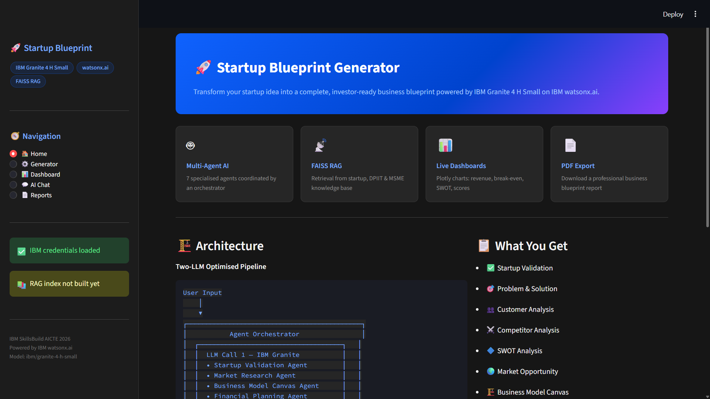
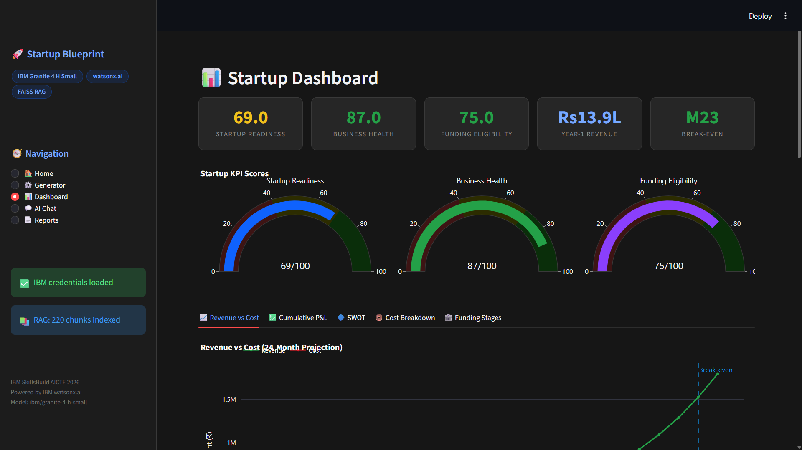
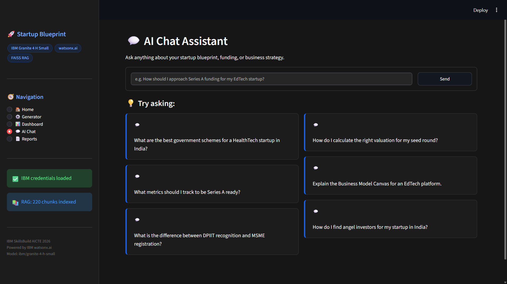
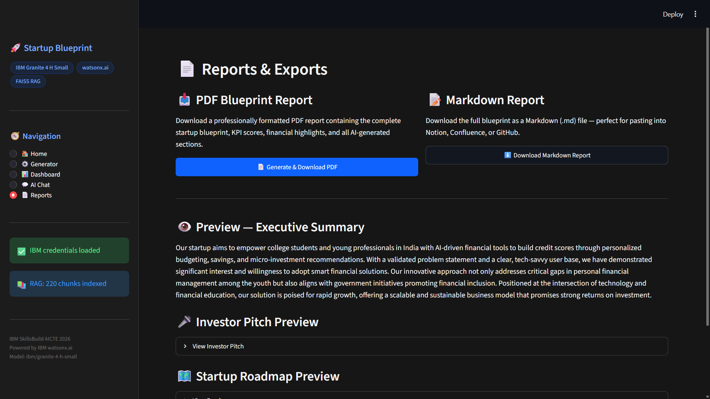

# 🚀 Startup Blueprint Generator
### AI-Powered Multi-Agent Business Planning Platform

> **IBM SkillsBuild AICTE Hackathon 2026 Project**

Transform any startup idea into a complete investor-ready business blueprint using **IBM Granite 4 H Small**, **IBM watsonx.ai**, **FAISS RAG**, and **Agentic AI**.

---

## 🌟 Project Overview

Startup Blueprint Generator is an AI-powered business planning platform that transforms a startup idea into a complete business blueprint within seconds.

Instead of generating a simple business summary, the system orchestrates multiple AI agents that validate ideas, perform market research, create financial plans, recommend government schemes, generate investor pitches, and produce an implementation roadmap.

The project combines:

- 🤖 IBM Granite 4 H Small
- ☁ IBM watsonx.ai
- 🧠 Multi-Agent AI
- 📚 FAISS Retrieval-Augmented Generation (RAG)
- 📊 Interactive Plotly Dashboards
- 📄 Professional PDF Reports

---

# ✨ Features

| Feature | Description |
|----------|-------------|
| 🤖 Multi-Agent AI | 7 specialized AI agents coordinated by a central Agent Orchestrator |
| ⚡ Two-LLM Architecture | Only **2 IBM Granite calls** per blueprint to reduce cost |
| 📚 FAISS RAG | Startup India, DPIIT, MSME, Funding & Incubator knowledge retrieval |
| 📋 20 Blueprint Sections | Complete investor-ready startup blueprint |
| 📊 Interactive Dashboard | KPI Cards, Gauges, Revenue Charts, SWOT, Cost Analysis |
| 💬 AI Chat Assistant | Startup-specific AI assistant with blueprint context |
| 📄 PDF Export | Professional ReportLab report |
| 📝 Markdown Export | GitHub / Notion ready export |
| 🎨 IBM Design | IBM-inspired dark enterprise UI |

---

# 🏆 Key Highlights

- ✅ IBM Granite 4 H Small
- ✅ IBM watsonx.ai
- ✅ Multi-Agent Architecture
- ✅ Retrieval-Augmented Generation (RAG)
- ✅ FAISS Vector Search
- ✅ Plotly Business Dashboard
- ✅ Financial Forecasting
- ✅ Government Scheme Recommendations
- ✅ Investor Pitch Generation
- ✅ Streamlit Cloud Ready

---

# 🛠 Technology Stack

## AI

- IBM Granite 4 H Small
- IBM watsonx.ai

## Backend

- Python 3.11

## Frontend

- Streamlit

## RAG

- FAISS
- Sentence Transformers

## Visualization

- Plotly

## Reports

- ReportLab

## Data Processing

- Pandas
- NumPy

## Knowledge Processing

- PyPDF2

---

# 🏗 System Architecture

```
                     User Startup Idea
                              │
                              ▼
                  Streamlit User Interface
                              │
                              ▼
                 Agent Orchestrator
                              │
          ┌────────────────────────────────┐
          │                                │
          ▼                                ▼
 IBM Granite Call 1                 Python Analytics
 Validation                         Revenue Projection
 Market Research                    KPI Scores
 Business Model                     Break-even
 Financial Planning                 Cost Breakdown
          │                                │
          └──────────────┬─────────────────┘
                         ▼
                 FAISS RAG Retrieval
                         │
                         ▼
               IBM Granite Call 2
        Funding • Pitch • Roadmap • Summary
                         │
                         ▼
              Startup Blueprint JSON
                         │
                         ▼
      Dashboard • AI Chat • PDF • Markdown
```

---

# 📋 Blueprint Sections

The generated blueprint contains **20 business sections**.

1. Startup Validation

2. Problem Statement

3. Solution Description

4. Target Customer Analysis

5. Competitor Analysis

6. SWOT Analysis

7. Market Opportunity

8. Business Model Canvas

9. Revenue Model

10. Pricing Strategy

11. Cost Estimation

12. Break-even Analysis

13. Funding Recommendations

14. Government Schemes

15. Investor Pitch

16. Startup Roadmap

17. Risk Assessment

18. Executive Summary

19. Future Scope

20. Final Recommendations

---

# 🤖 Multi-Agent Architecture

| Agent | Responsibility | IBM Call |
|--------|---------------|----------|
| Startup Validation Agent | Validate startup idea | Call 1 |
| Market Research Agent | Customers, Competition, SWOT | Call 1 |
| Business Model Agent | Business Model Canvas | Call 1 |
| Financial Planning Agent | Revenue & Pricing | Call 1 |
| Funding Advisor Agent | Funding & Government Schemes | Call 2 |
| Investor Pitch Agent | Investor Pitch Generation | Call 2 |
| Startup Roadmap Agent | Roadmap, Risks & Summary | Call 2 |

---

# 📊 Dashboard

Interactive dashboard includes:

- Startup Readiness Score

- Business Health Score

- Funding Eligibility Score

- Revenue Projection

- Cost Breakdown

- Break-even Analysis

- SWOT Visualization

- Revenue vs Cost

- Funding Timeline

---

# 📷 Application Screenshots

## 🏠 Startup Idea Generator

> AI-powered startup idea input interface built with IBM-inspired Streamlit UI.



---

## 📊 Business Intelligence Dashboard

> Interactive dashboard showing KPI cards, revenue projections, SWOT analysis, financial insights, and Business Model Canvas.



---

## 💬 AI Startup Assistant

> Context-aware AI assistant powered by IBM Granite and FAISS RAG for answering startup, funding, and business strategy questions.



---

## 📄 Professional Business Blueprint Report

> Automatically generated investor-ready PDF containing 20 structured startup blueprint sections.



---
---

# 📦 Project Structure

```
StartupBlueprintGenerator/

├── app.py

├── agents.py

├── rag.py

├── utils.py

├── requirements.txt

├── README.md

├── .env.example

├── data/

└── assets/
```

---

# ⚙ Installation

```bash
git clone <repository>

cd StartupBlueprintGenerator

python -m venv venv

# Windows

venv\Scripts\activate

# Linux

source venv/bin/activate

pip install -r requirements.txt

streamlit run app.py
```

---

# 🔑 Environment Variables

Create a `.env`

```env
IBM_API_KEY=

IBM_PROJECT_ID=

IBM_WATSONX_URL=https://us-south.ml.cloud.ibm.com

IBM_REGION=us-south

MODEL_ID=ibm/granite-4-h-small
```

---

# ☁ Streamlit Deployment

1. Push repository to GitHub

2. Deploy using Streamlit Community Cloud

3. Add the same IBM credentials as Streamlit Secrets

4. Deploy

---

# 📚 Knowledge Base

Supports:

- PDF

- TXT

Built-in Knowledge includes:

- Startup India

- DPIIT

- MSME

- Government Schemes

- Funding

- Business Model Canvas

- Market Sizing

- Investor Pitch

Additional PDF/TXT files placed inside the **data/** folder are automatically indexed by FAISS.

---

# 🔒 Security

- No credentials stored in code

- Uses environment variables

- IBM API Keys remain private

- No user data is stored

---

# 🚀 Future Enhancements

- Multi-language support

- Startup valuation module

- Team collaboration

- Pitch Deck Generator

- Cloud Database

- CRM Integration

- Live Market Intelligence

- Financial Scenario Simulator

---

# 👨‍💻 Author

**Vaibhav Awchar**

B.Tech Computer Science (AI & ML)

IBM SkillsBuild AICTE Hackathon 2026

---

# 📄 License

MIT License

---

## ⭐ Built with

- IBM Granite 4 H Small

- IBM watsonx.ai

- Streamlit

- FAISS

- Plotly

- ReportLab

- Python

---